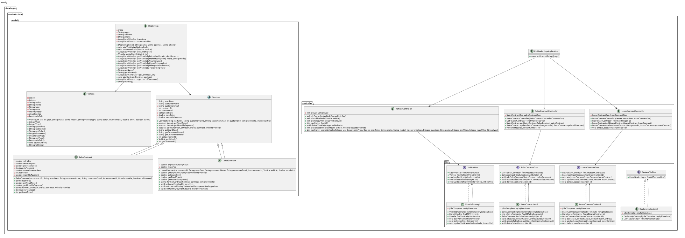

# Car Dealership System

- [1: Overview](#1-overview)
- [2: Features](#2-features)
- [3: User Stories](#3-user-stories)
- [3.1: Frontend Developer Displays Vehicles](#31-frontend-developer-displays-vehicles)
- [3.2: Frontend Developer Manages Vehicle Purchases](#32-frontend-developer-manages-vehicle-purchases)
- [4: Lessons Learned](#4-lessons-learned)

## 1: Overview
My emphasis in this project was to implement spring boot api for a car dealership system. By the use of spring boot, I
was able to create a RESTful API that allows users to manage vehicle inventory, create sales and lease contracts, by
using postman to test the url endpoints.

## UML Diagram


## 2: Features
- **Manage Vehicle Inventory**: Add, update, delete, and view vehicles in the dealership's inventory.
- **Sales Contracts**: Create, update, delete, and view sales contracts for vehicle purchases.
- **Lease Contracts**: Create, update, delete, and view lease contracts for vehicle leases.


## 3: User Stories

### 3.1: Frontend Developer Displays Vehicles
Title: Frontend Developer Displays Vehicles
As a frontend developer, I want to use the backend to display the available vehicles so that customers can choose one to purchase or lease.
Scenario:
```
- Given the frontend developer is using the backend API
- When the frontend developer requests to view vehicles
- Then the backend should return a list of available vehicles
```
Acceptance Criteria:
```
- The backend should return the vehicle's make, model, year, price, and other relevant details
- The frontend developer should be able to filter vehicles by make, model, year, price, and other criteria
- The frontend developer should be able to request detailed information about a specific vehicle
```

### 3.2: Frontend Developer Manages Vehicle Purchases
Title: Frontend Developer Manages Vehicle Purchases
As a frontend developer, I want to use the backend to manage vehicle purchases so that customers can own a vehicle.
Scenario:
```
- Given the frontend developer is using the backend API
- When the frontend developer requests to purchase a vehicle
- Then the backend should create a sales contract for the vehicle
```
Acceptance Criteria:
```
- The backend should prompt the frontend developer to provide customer details (name, email, etc.)
- The backend should generate a sales contract with the correct details and price
```

## 4: Lessons Learned
During the development of this project, I learned about Spring Boot, RESTful APIs,
and various design principles and patterns. Here are some of the key lessons learned:
### Injections
Dependency injection was used to inject dependencies into classes, such as the `VehicleService` and `ContractService` 
classes. This allowed me to pass dependencies to classes without creating them in the class itself.
### Utilizing Spring Web to Create RESTful APIs
Spring Web was used to create RESTful APIs that allowed users to interact with the application through HTTP requests.
### Utilizing Spring Data JPA for Database Operations
Spring Data JPA was used to interact with the database and perform CRUD operations on entities. 
This allowed me to focus on the business logic of the application without worrying about the database operations.

## 5: How to Use

1. **Clone the Repository:**
   ```bash
   git clone https://github.com/AlanChumsawang/car-dealership.git
   cd car-dealership
   ```

2. **Upload the MySQL Schema and Data:**
    - Create a MySQL database named `car_dealership_database`.
    - Import the schema and data from the provided SQL files:
      ```bash
      mysql -u root -p car_dealership_database < path/to/schema.sql
      mysql -u root -p car_dealership_database < path/to/data.sql
      ```

3. **Add Your Own Environmental Variables:**
    - Update the `src/main/resources/application.properties` file with your MySQL credentials:
      ```ini
      spring.datasource.url=jdbc:mysql://localhost:3306/car_dealership_database
      spring.datasource.username=your_mysql_username
      spring.datasource.password=your_mysql_password
      spring.datasource.driver-class-name=com.mysql.cj.jdbc.Driver
      ```

4. **Run the Application:**
   ```bash
   mvn spring-boot:run
   ```

5. **Test in Postman:**
    - Import the `Car-dealership.postman_collection.json` file into Postman.
    - Use the provided endpoints to test the application:
        - `POST /vehicles` to add a new vehicle.
        - `GET /vehicles` to retrieve all vehicles.
        - `GET /vehicles/search` to search for vehicles with specific criteria.
        - `PUT /vehicles/update/{vin}` to update a vehicle.
        - `DELETE /vehicles/delete/{vin}` to delete a vehicle.
        - `POST /sales` to create a new sales contract.
        - `GET /sales` to retrieve sales contracts.
        - `DELETE /sales/delete/{id}` to delete a sales contract.
        - `POST /leases` to create a new lease contract.
        - `GET /leases` to retrieve lease contracts.
        - `DELETE /leases/delete/{id}` to delete a lease contract.